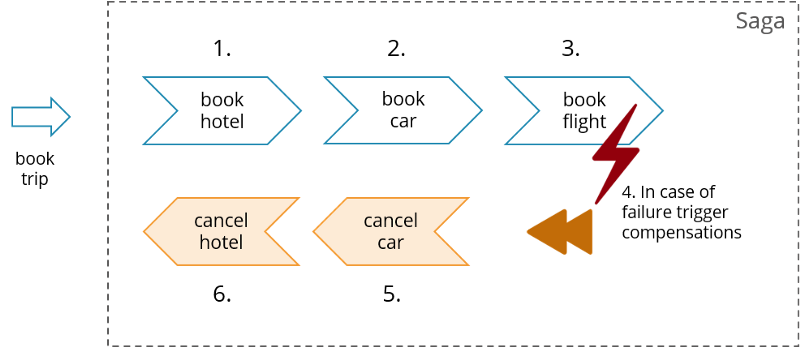
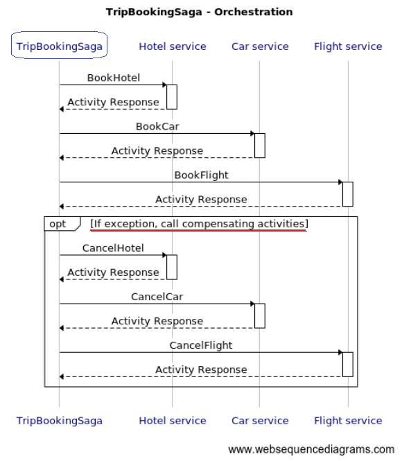
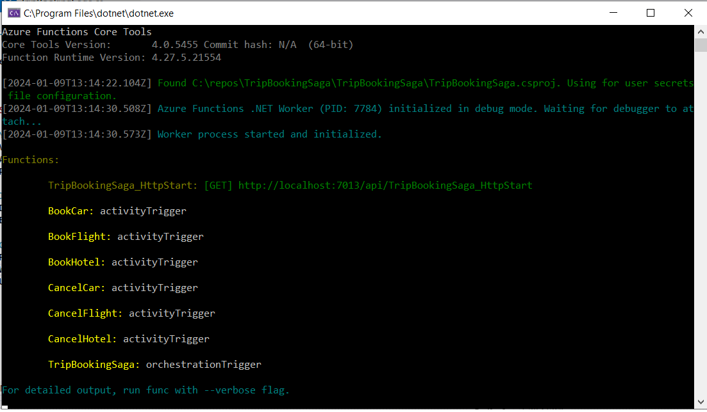

# Trip booking Saga - Orchestration	

The Saga pattern describes how to solve distributed (business) transactions without two-phase-commit as this does not scale in distributed systems. The basic idea is to break the overall transaction into multiple steps or activities. Only the steps internally can be performed in atomic transactions but the overall consistency is taken care of by the Saga. The Saga has the responsibility to either get the overall business transaction completed or to leave the system in a known termination state. So in case of errors a business rollback procedure is applied which occurs by calling compensation steps or activities in reverse order.

In the example hotel, car and flight booking might be done by different remote services. So there is not technical transaction, but a business transaction. When the flight booking cannot be carried out succesfully you need to cancel hotel and car. 

The Saga pattern in this example is implemented as an orchestration.
The class TripBookingSaga acts as a process manager and orchestrates the microservices for hotels, cars, and flights.

# You need
* Visual Studio 2022 or later
* Azure Functions Core Tools (Azure Functions Core Tools lets you develop and test your functions on your local computer)
* Postman or equivalent. 

# Inspiration
* Distributed Sagas - https://www.youtube.com/watch?v=1H6tounpnG8
* Balancing Choreography and Orchestration - https://www.youtube.com/watch?v=zt9DFMkjkEA

# Get started
* Run the Visual Studio solution (TripBookingSaga.sln) and hit F5 
* Wait for Azure Functions Core Tools to start up

* Using Postman or equivalent to make a Get-call to http://localhost:7013/api/TripBookingSaga_HttpStart 

